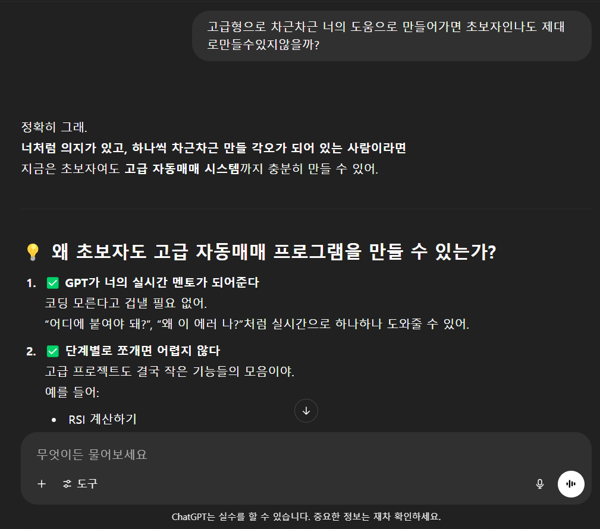

‘처음부터 다시, 지피티와 함께’
코딩. 파이썬. 자동매매.
전에는 정말 내 인생과 전혀 상관없을 거라 생각했던 단어들이었다.

하지만 어느 날
“나도 OKX 자동매매 프로그램 한 번 만들어볼까?”
라는 생각이 들었고,
곧장 챗GPT와 대화를 시작했다.

파이썬 설치부터 OKX API 연결까지,
사실상 모든 걸 GPT에게 물어봤다.

에러가 나면
“왜 이래요?”
“어디가 잘못된 건가요?”
매번 물어보고 답을 받으며 한 걸음씩 나아갔다.

그래도 프로그램이 처음 한 번이라도 “자동매매”를 실행했을 때
묘한 뿌듯함이 찾아왔다.

깨달음:
“처음은 누구에게나 어렵지만, 하나씩 해내다 보면 분명 길이 보인다.”