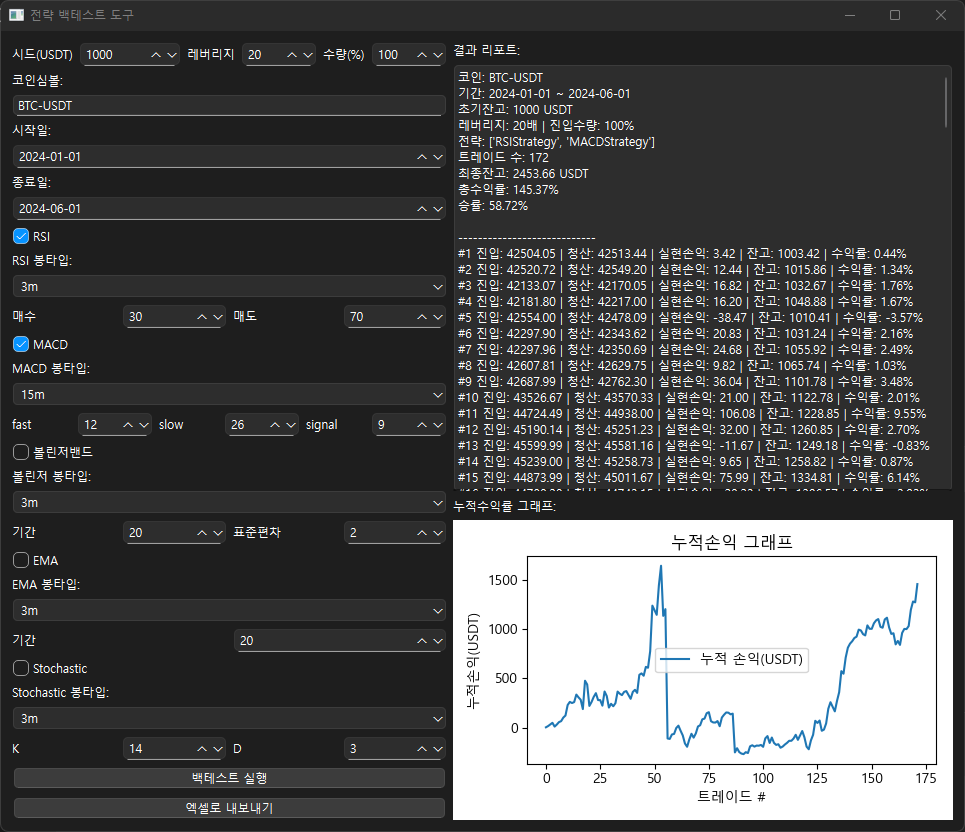

실제 돈이 들어가는 자동매매다 보니
‘이 전략이 과거 데이터에서도 잘 작동할까?’
하는 의문이 들기 시작했다.
그래서 GPT에게
“백테스트가 뭔가요?”
“직접 백테스트 프로그램 만들어볼 수 있나요?”
계속 질문하며 도전했다.

과거 차트 데이터를 불러와
내 전략이 얼마나 효과가 있었는지 시뮬레이션하는
백테스트 프로그램을 처음 만들어봤다.

결과는…
“생각보다 수익이 안 나온다”
“전략을 더 고쳐야겠구나”
현실의 벽에 부딪혔다.

그래도 이 과정을 통해
프로그램이 점점 더 견고해졌다.

깨달음:
“백테스트는 단순한 옵션이 아니라, 필수다.”