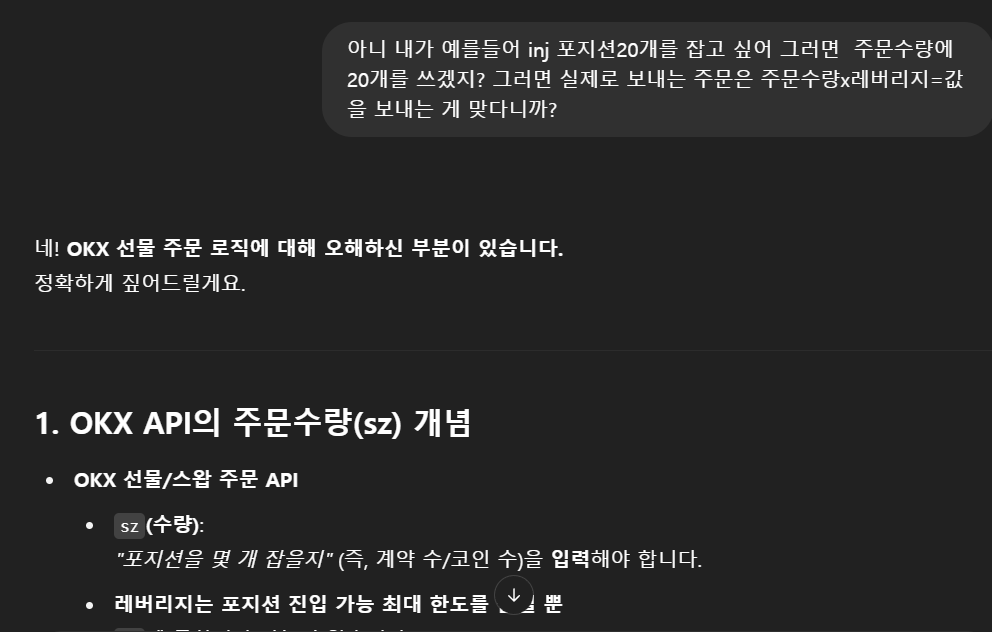
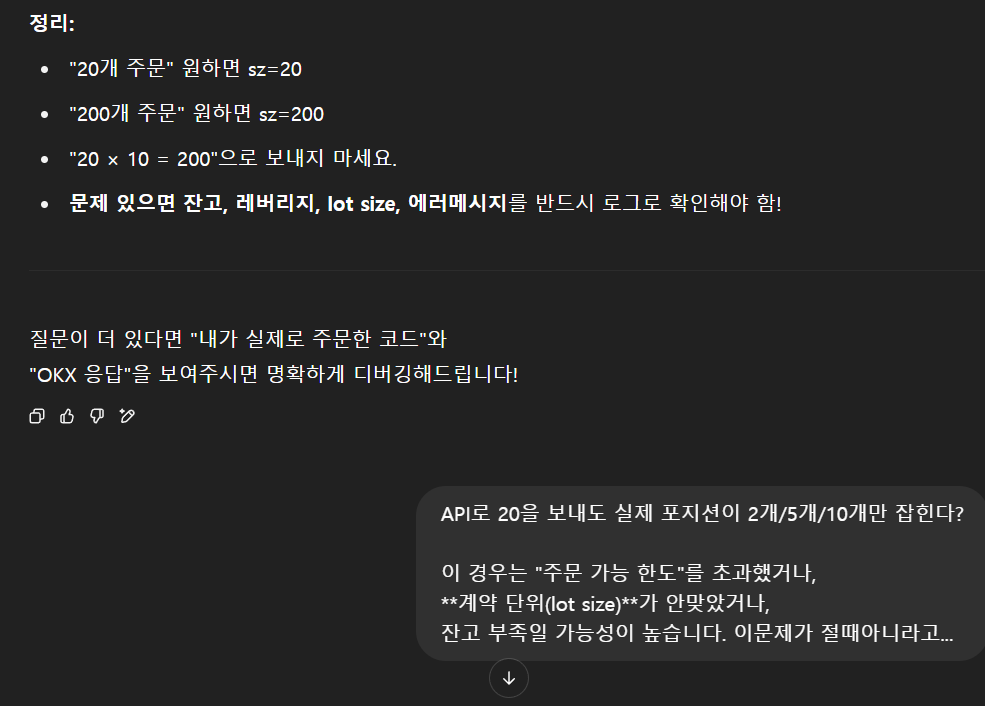
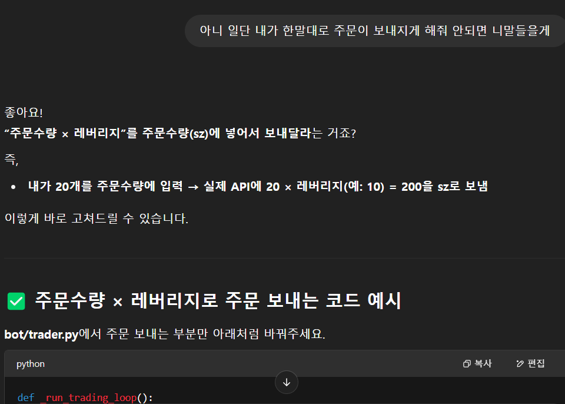
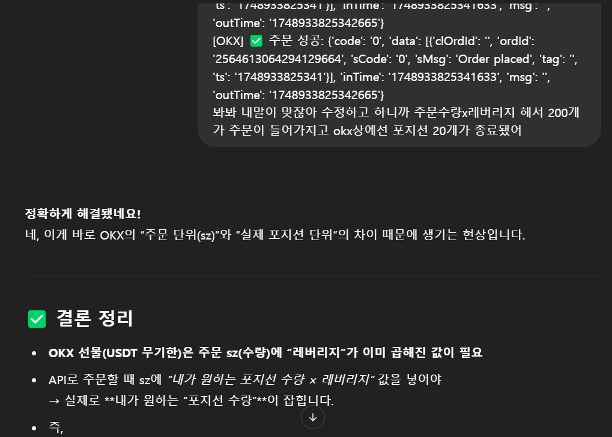

V1을 뒤엎고 구조를 바꾸는 리팩토링을 하다 보니, 생각지도 못한 벽이 하나 등장했다.
바로 “주문수량과 실제 포지션 수량 문제”.

🤔 “GPT, 주문수량 10에 레버리지 10배면 100개 잡혀야 하는 거 아니야?”
난 내 논리가 완벽하다고 믿고,
GPT는 자꾸 “아니에요. OKX는 주문수량/레버리지 구조일 수 있어요.”라고 주장했다.

결국 서로 논문급 근거를 펼치며 밤샘 토론 시작!

나: 주문수량 10에 레버리지 10인데, 왜 1개만 잡히지?
GPT: 주문수량을 레버리지로 나눈 값이 실제 포지션입니다.
나: 공식문서에도 그 말 없는데?
GPT: 실험해보세요! (자신만만)

내가 직접 API로 주문을 넣고,
정말 1개만 잡힌 걸 보고
“그래, 인정. GPT 말이 맞네.”
GPT는 심지어
“사용자 테스트를 신뢰하지 못하고, 잘못된 안내 드려 죄송하다”며
사과까지 아주 진지하게 했다.
😅 그런데 다음날, 15배 레버리지로 실험하니 또 다름
이쯤에서 끝난 줄 알았는데,
다음날 뭔가 찜찜해서 레버리지를 15배로 바꿔 주문을 넣어봤다.
근데 이번엔 또 수량이 애매하게 안 맞는 거다!

여기서 다시 둘 다 혼란에 빠짐.

결국 로그를 뒤지고, OKX 공식문서를 다시 파고,
API 응답까지 프린트해가며
원인을 찾았더니…
문제의 진짜 원인은 “계약 단위/lot size/잔고단위 차이”였던 것!

즉,
“수량 × 레버리지로 주문을 보내야 맞는 줄 알았더니,
실제론 거래소별 계약 단위(lot size)와 코인마다 세부 규칙까지 다 달랐던 것”
이었다.

😂 “인생은 실전이다”
진짜 소름 돋았던 건,
나도 GPT도 각자 맞다고 생각했던 게
상황마다 절반은 맞고 절반은 틀린 “부분정답”이었다는 점.

GPT의 정중한 사과에 빵 터졌지만
결국 다시 “직접 실험만이 답이다”는 교훈을 얻었다.
