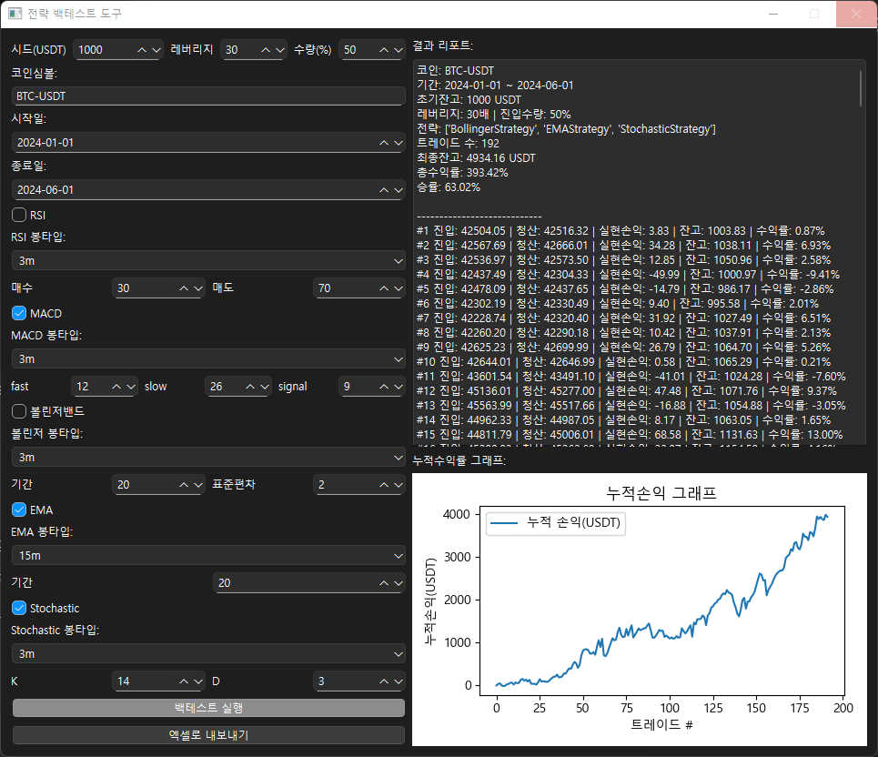
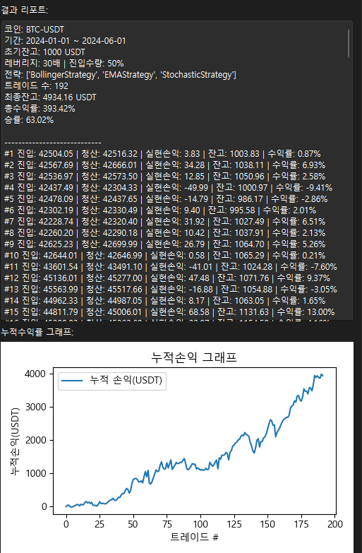

📊 전략 백테스트, 이제는 필수다
내가 만든 전략,
직접 돈 넣고 돌리기 전에
“과거 데이터로 테스트”하는 게 바로 백테스트다.

이번엔 내가 만든 전략 백테스트 툴을 이용해서
다양한 인디케이터(RSI, MACD, 볼린저밴드, EMA, Stochastic 등)를
설정해가며 여러 가지 조합으로 실험해봤다.

각종 파라미터를 원하는 대로 바꿀 수 있고,
결과 리포트와
누적 손익 그래프가 바로 표시된다.

예를 들어,

코인: BTC-USDT

레버리지: 30배

진입수량: 50%

기간: 2024-01-01 ~ 2024-06-01

전략: Bollinger, EMA, Stochastic 조합

실행 한 번이면
거래 내역과 누적 손익까지 한눈에 확인!

리포트를 보니
총 192회의 트레이드에
최고자산 4,934 USDT,
총 수익률 393%,
승률 63% 등
생각보다 좋은 결과가 나와서
뿌듯함과 동시에
“이게 실전에도 먹힐까?”라는 새로운 의문도 생겼다.

특히
실제 매매 전략과 진입/청산 조건이
내가 상상한 대로 잘 동작하는지,
그래프를 통해 “직관적으로” 확인할 수 있다는 게
직접 프로그램을 만들며 느낀 가장 큰 장점이다.
다음에는
실제 실전 투자 적용기,
혹은 새로운 전략 테스트 결과도
공유해보겠습니다.