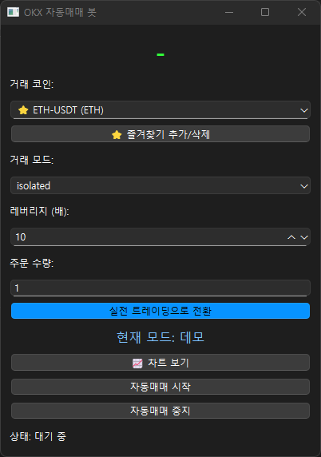

파이썬, 코딩, 자동매매.
사실 불과 몇 달 전만 해도 이 단어들이 내 일상과 연결될 거라곤 생각 못했다.

이 글은,
코딩에 ‘코’자도 모르던 내가
챗GPT라는 인공지능과 함께
OKX 자동거래 프로그램을 만들어 가는 과정을 기록한 일종의 개발 일지다.

시작: ‘나도 한번 만들어볼 수 있을까?’
요즘 코인 시장을 보면 자동매매 프로그램이 심심치 않게 언급된다.
나 역시 “직접 만들어보고 싶다”는 막연한 호기심에서 출발했다.

처음엔 솔직히 자신감보다 걱정이 더 컸다.
기초적인 개념조차 제대로 모르던 내가
과연 이런 프로그램을 만들 수 있을까 싶었다.

하지만 GPT를 통해 하나하나 물어보고,
조금씩 답을 얻다 보니
생각보다 진도가 나가는 게 신기했다.

V1: 시행착오의 연속
처음 만든 V1 버전은
기본적인 매매 로직만 단순하게 넣은 형태였다.

하지만 막상 실행해보니
에러 메시지는 쉴 틈 없이 쏟아지고,
원인을 찾다가 며칠을 보낸 적도 있다.

이 과정에서 느꼈던 건,
‘코딩은 작은 실수 하나가 전체를 멈추게 만들 수 있다’는 점이었다.
문제를 하나 해결하면 또 다른 문제가 튀어나오는,
그야말로 ‘디버깅의 늪’이었다.