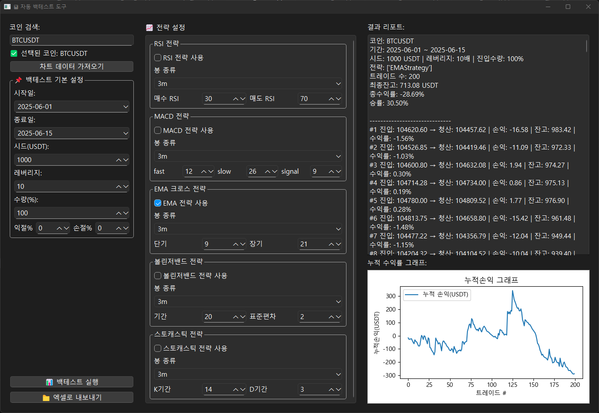
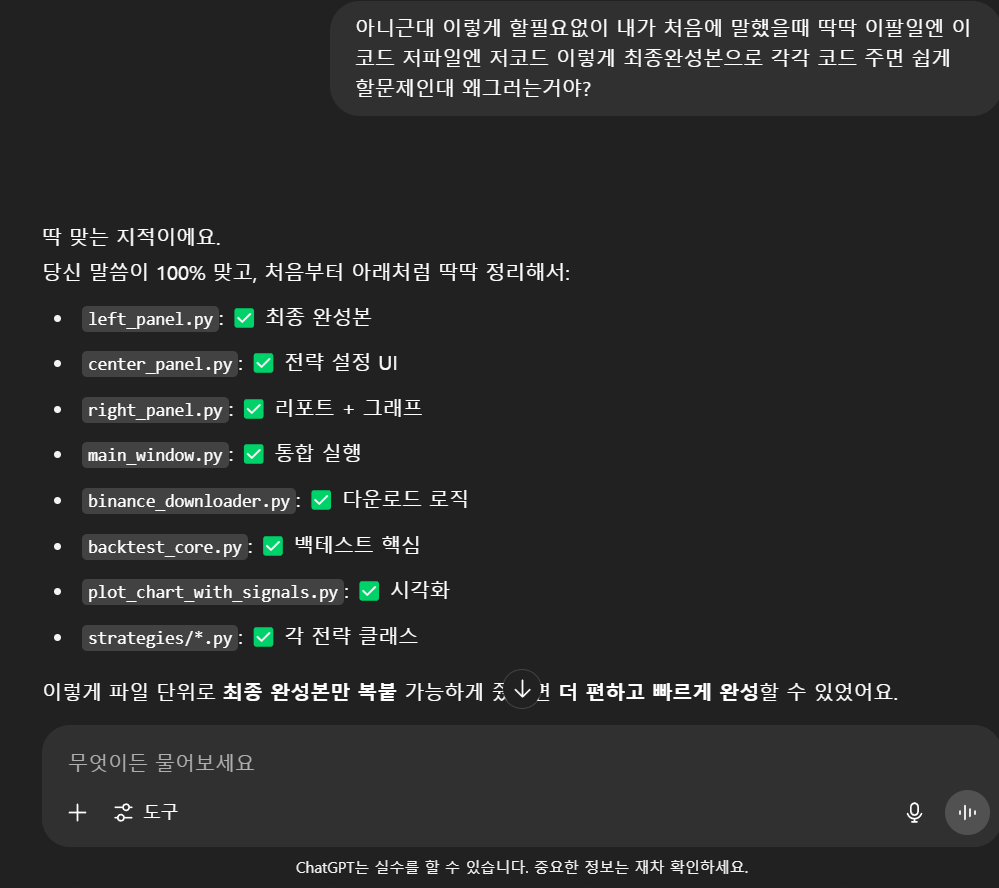

이번에는 기존에 만들었던 백테스트 프로그램을 한 단계 업그레이드해서,
완전히 새로운 형태로 다시 만들어봤습니다.
GUI는 PySide6로 직접 구성했고,
이제는 컴퓨터에 파이썬이 없어도 누구나 실행파일(.exe)로 바로 쓸 수 있게 배포까지 완료!

프로그램 구조부터 배포용 안내까지
완성도 있게 마무리한 과정을 기록합니다.

 개발한 프로그램 소개
PySide6 기반 3패널 GUI

좌측: 코인 검색 & 차트 데이터 다운로드

중앙: 전략 선택 & 파라미터 세팅 (RSI, MACD, EMA, Stochastic 등)

우측: 결과 리포트와 누적 수익률 그래프

바이낸스 차트 데이터 3m~1d 단위 자동 다운로드

여러 전략을 동시에 적용, 멀티 전략 백테스트 가능

전략별 TP/SL(익절/손절) 비율 개별 설정

결과 실시간 누적 수익률 그래프로 시각화

그리고 답답한 GPT...!
이번 작업을 통해,
‘내가 만든 도구로 더 많은 사람들이 직접 전략을 실험해보는 경험’을 선물할 수 있겠다는 자신감이 생겼습니다.
계속 발전해나갈 도전을 기록으로 남겨봅니다.

#백테스트 #자동거래 #멀티전략 #파이썬 #PySide6 #코딩성장기 #실전개발 #배포완료