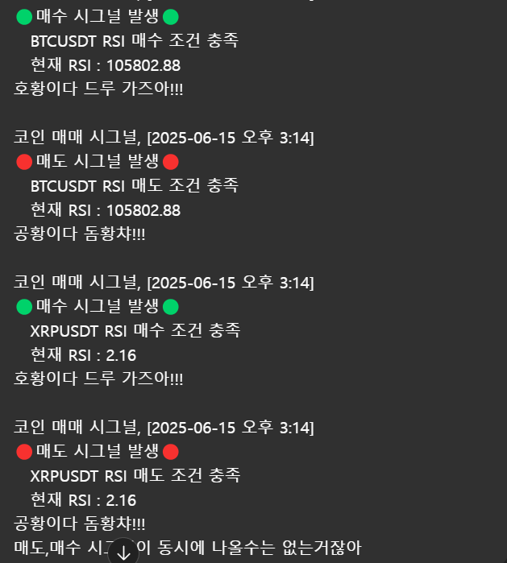

백테스트 프로그램은 잘 개발해서
이제는 유지보수나 수정, 보완하는 일만 남았습니다.

매매 프로그램도 일단 어중간하게 완성해 놨는데,
구현하고 싶은 부분은 다 구현해 둔 상태입니다.

이제 백테스트 정보를 토대로 전략들을 설정하고
오토 트레이딩을 돌리면서
신뢰도와 신빙성을 테스트하는 기간이 될 것 같습니다.

두 프로그램 모두 테스트 기간으로 넘어가고,
오늘은 새로운 아이디어가 떠올라 개발을 시작했습니다.

코딩 왕초보인 내가 프로젝트 결과물이 쌓이다 보니
생각보다 빠르게 작업을 끝낸 것 같아 뿌듯하네요.

작동 원리는 바이낸스 무기한 선물에 상장된
코인들의 4시간 차트 정보를 받아와서
각각 전략(RSI, MACD, BB)으로 계산한 뒤에,

전략들의 매수 신호가 뜬 개수대로
매수 신호, 강력 매수 신호, 초강력 매수 신호로 나눠서
텔레그램 메시지로 받을 수 있게 하고 싶었습니다.

재미있는 멘트도 넣어봤는데,
뭔가 ‘이거다!’ 싶은 멘트가 아직 없네요;;

현재는 BTC, ETH, SOL, XRP, INJ, LINK, ONDO 코인들만 지원되고
테스트를 거치면서 신뢰도가 올라가면 하나씩 추가할 생각입니다.

사실 원래는 백테스트, 매매 프로그램에서 쓰는 전략 5가지를 다 추가해
사용하려 했지만,

이상하게 매도 신호와 매수 신호가 동시에 뜨는 상황이 계속 발생해서
원인을 찾아보니, 너무 많은 전략을 동시에 사용하다 보니 신호가 뒤죽박죽 되는 것 같았습니다.

그래서 과감히 백테스트 결과를 바탕으로
승률이 좋은 3가지 전략만 추려서 만들어 봤습니다.

상상하는 것을 직접 만드는 게 취미라 그런지
이 작업이 정말 재미있네요.

당분간은 세 프로그램을 지켜보면서
피드백도 받고 완성도를 높이는 시간으로 가지려고 합니다.

아래 텔레그램 링크도 올려두겠으니
관심 있으신 분들은 매수 신호 받아보세요!

**[매매시그널 채널입장](https://t.me/+EnX__qckmi9hYjRl)**