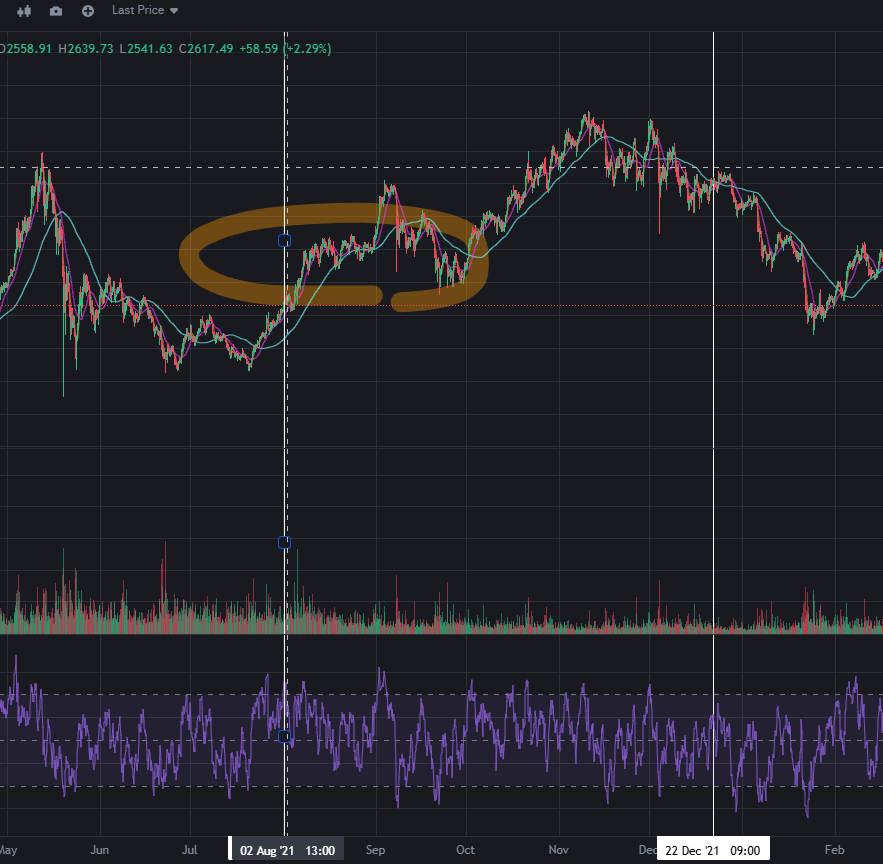
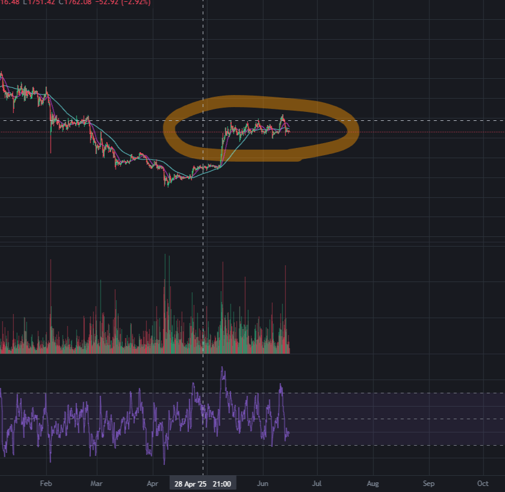
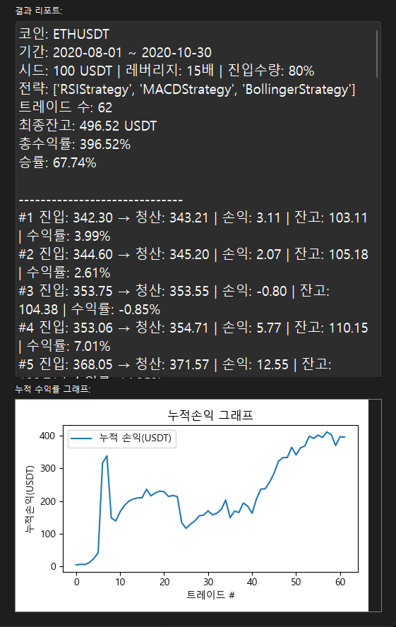
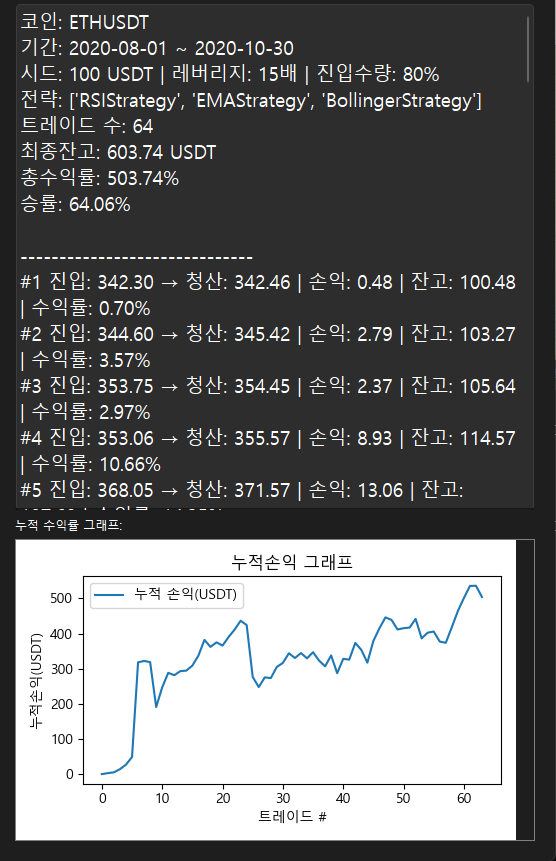

백테스트를 돌려 최상의 전략 조합을 찾아보기로 했다.
대상은 이더리움으로 정했고,
내 나름대로 지금 차트 분위기와 움직임이 비슷한 구간을 찾아봤다.

2021년 8월부터 10월 30일까지 기간을 정하고,레버리지 15배 잔고에 80% 운용 매수신호 매도신호에만 매매하게 설정
하고 전략들을 바꿔가며 테스트했다.

아래는 RSI 3분봉, MACD 15분봉, 볼린저 밴드 3분봉 세팅을 적용해 돌린 결과다.

이건 RSI 3분봉, EMA 15분봉, 볼린저 밴드 3분봉 세팅을 적용해 돌린 결과다.

두조합 모두 준수한 성적을 내고 있다