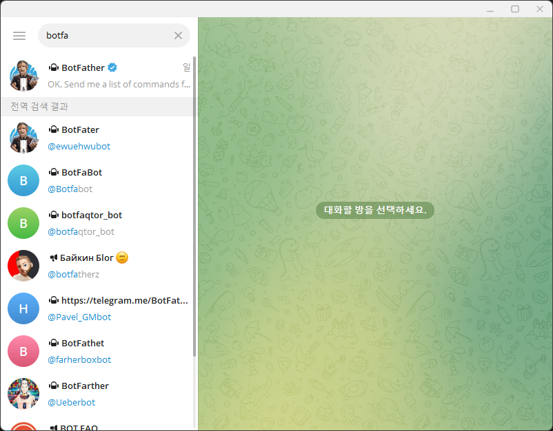
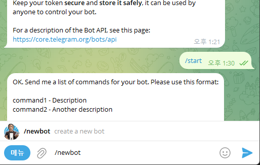
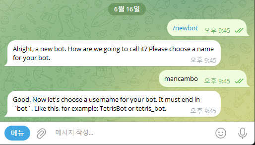
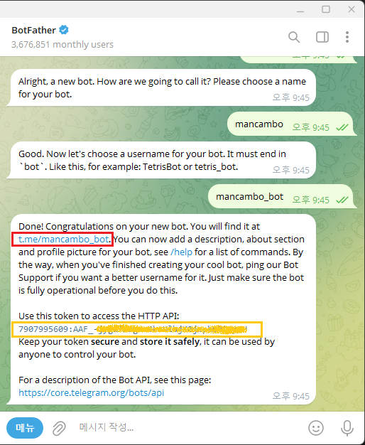
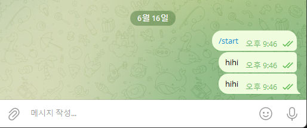
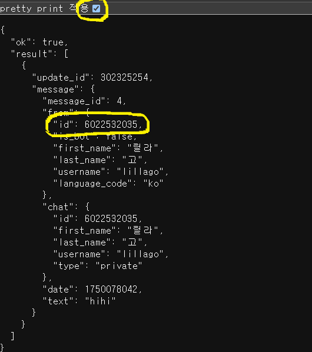

“아니, 텔레그램 봇 만든다는데 도대체 어디서부터 손대야 하지?”
“챗ID 찾으라는데, 이게 왜 이렇게 헷갈려?”

그런 분들을 위해 초보도 10분 만에 따라할 수 있는
실전 설명을 준비했습니다.

1. BotFather로 새 봇 만들기
① 텔레그램에서 BotFather 검색
설명:
텔레그램 앱을 켜고, 왼쪽 상단 검색창에 BotFather라고 치세요.
파란 체크가 붙은 BotFather를 찾으면 됩니다.

② BotFather와 대화해서 새 봇 만들기
설명:
BotFather 창에서 /start 치고,
/newbot을 입력하면 새로운 봇 생성이 시작됩니다.

③ 봇 이름(아무거나) 입력
설명:
"What's the name of your bot?"이 나오면
맘에 드는 한글/영문 이름을 입력(예: mancambo)

④ 봇 사용자명(영문, _bot으로 끝나야 함) 입력
설명:
“It must end in 'bot'” 문구가 나오면
예: mancambo_bot 처럼 끝에 _bot 붙여 입력

**⑤ 생성 완료!
봇 링크와 토큰 복사하기**
봇이 완성되면
t.me/내봇아이디 링크(빨간 박스)와
봇 토큰(노란 박스)이 표시됩니다.
(토큰은 내 봇의 “열쇠”이니 꼭 안전하게 복사/보관!)

2. 내 봇에 메시지 보내기(챗ID 추출 준비)
설명:
이제 완성된 봇을 텔레그램에서 찾아 /start나 아무 말이나 보내세요.
이 작업을 해야 나중에 챗ID를 찾을 수 있습니다.

3. 내 챗ID 찾기 (getUpdates API 활용)
① 브라우저에서 챗ID 확인
설명:
아래 주소에서 <봇토큰> 부분에 아까 복사한 토큰을 붙여서
브라우저 주소창에 입력:
https://api.telegram.org/bot<봇토큰>/getUpdates
예시: https://api.telegram.org/bot123456789:AA.../getUpdates

메시지를 보냈다면 결과값에 "chat":{"id":숫자, ...}가 포함되어 있음
이 숫자가 챗ID!

추가 꿀팁!
봇 토큰과 챗ID는 노출/공유하지 마세요! (유출 위험)

챗ID가 자꾸 바뀌거나 여러 개라면,
getUpdates 결과에서 "chat":{"id":...}를 찾으세요.

그룹 챗ID는 음수(-)로 시작하고,
개인 챗ID는 양수입니다!